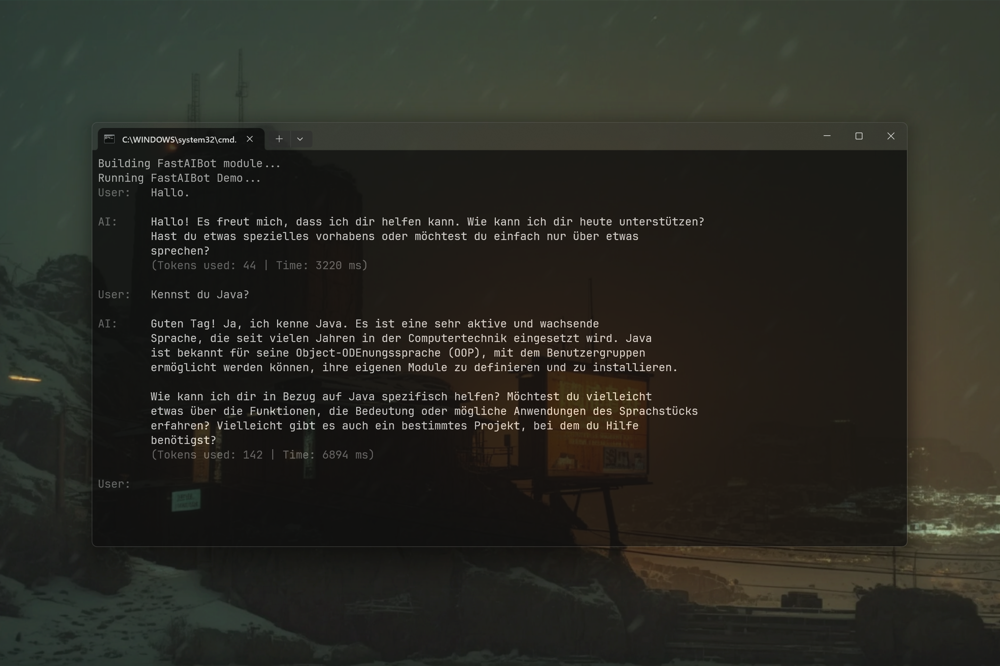

# FastAIBot 0.1.2 [ALPHA-2026-08] — High-Performance Bot Orchestrator for Java

[]()
[](https://opensource.org/licenses/MIT)
[](https://www.java.com)
[]()
[](https://jitpack.io/#andrestubbe/FastAIBot)

**⚡ A zero-latency, asynchronous orchestration runtime connecting LLM brains and conversation memory.**

FastAIBot is the orchestrator of the **FastJava** ecosystem. It bridges the pure AI generation of `FastAI` with persistent state (`FastAIMemory`) and streaming interfaces.

By streaming LLM output tokens in real-time, FastAIBot enables instant responses without JSON-parsing latency.

[](https://youtu.be/Om9eVAcbSA8)

---

## Quick Start — Example

```java
import fastaibot.FastAIBot;
import fastai.FastAI;
import fastai.AI;
import java.util.function.Consumer;

public class Demo {
    public static void main(String[] args) {
        // 1. Connect the Brain
        AI brain = FastAI.connect("gemini:gemini-2.5-flash", "api-key");

        // 2. Define Text Output Consumer
        Consumer<String> textOut = text -> System.out.print(text);

        // 3. Boot the Bot
        FastAIBot bot = new FastAIBot(brain, "You are a helpful AI...", textOut);

        // 4. Talk (Streams instantly)
        bot.streamChat("Are you a bot in a monitor?");
    }
}
```

---

## Table of Contents
- [Why FastAIBot?](#why-fastaibot)
- [Key Features](#key-features)
- [Architecture Overview (FastAIBot vs FastAI)](#architecture-overview-fastaibot-vs-fastai)
- [API Quick Reference](#api-quick-reference)
- [Installation](#installation)
- [Documentation](#documentation)
- [Platform Support](#platform-support)
- [License](#license)

---

## Why FastAIBot?
Traditional AI frameworks add heavy abstraction layers and slow JSON parsing overhead, introducing noticeable latency to live interactions. FastAIBot provides a zero-latency, high-performance orchestration layer for Java. It connects `FastAI`'s stateless LLM stream directly with `FastAIMemory`'s context history, streaming incoming response tokens to your application in real-time.

---

## Key Features
* **🚫 Zero Lag Streaming** — Passes tokens directly as they arrive without JSON-parsing overhead.
* **🧠 Context Awareness** — Seamlessly integrates with `FastAIMemory` for session persistence.
* **⚡ State-Minimized** — Built entirely in pure Java with zero heavy framework bloat.

---

## Architecture Overview

**FastAI (The Brain)**  
Minimalist, hyper-fast Java LLM client.
- Zero dependencies.
- No event system.
- No state management.
→ *Input: Prompt in, Tokens out.*

**FastAIMemory (The Memory)**  
Module for managing conversation contexts and histories.
- **ConversationHistory**: Stores and structures dialogue histories (System, User, Assistant).
- **MemoryContextBuilder**: Constructs formatted context prompts for LLMs.

**FastAIBot (The Orchestrator)**  
Lightweight orchestrator runtime for interactive bot systems.
- Connects `FastAI` (LLM inference) and `FastAIMemory` (context management).
- Manages real-time multi-turn conversation flow and streams tokens without overhead.

---

## API Quick Reference

| Method | Description | Path |
|--------|-------------|------|
| `streamChat(String)` | Sends input to FastAI and streams the mixed output. | [Reference →](docs/REFERENCE.md#streamchat) |
| `getHistory()` | Returns the active `ConversationHistory`. | [Reference →](docs/REFERENCE.md#gethistory) |

> [!TIP]
> See **[REFERENCE.md](docs/REFERENCE.md)** for full documentation.

---

## Installation

FastAIBot integrates with the FastJava ecosystem modules for LLM streaming, memory context management, and native SIMD String acceleration.

### Maven (JitPack)
```xml
<repositories>
    <repository>
        <id>jitpack.io</id>
        <url>https://jitpack.io</url>
    </repository>
</repositories>

<dependencies>
    <!-- FastAIBot Orchestrator -->
    <dependency>
        <groupId>com.github.andrestubbe</groupId>
        <artifactId>fastaibot</artifactId>
        <version>0.1.2</version>
    </dependency>

    <!-- FastAI & FastAIMemory -->
    <dependency>
        <groupId>com.github.andrestubbe</groupId>
        <artifactId>FastAI</artifactId>
        <version>0.1.4</version>
    </dependency>
    <dependency>
        <groupId>com.github.andrestubbe</groupId>
        <artifactId>FastAIModel</artifactId>
        <version>0.1.1</version>
    </dependency>
    <dependency>
        <groupId>com.github.andrestubbe</groupId>
        <artifactId>FastAIMemory</artifactId>
        <version>0.1.3</version>
    </dependency>

    <!-- FastJava Core & Utility Dependencies -->
    <dependency>
        <groupId>com.github.andrestubbe</groupId>
        <artifactId>FastString</artifactId>
        <version>0.1.0</version>
    </dependency>
    <dependency>
        <groupId>com.github.andrestubbe</groupId>
        <artifactId>FastJSON</artifactId>
        <version>0.1.2</version>
    </dependency>
    <dependency>
        <groupId>com.github.andrestubbe</groupId>
        <artifactId>FastCore</artifactId>
        <version>0.1.0</version>
    </dependency>
</dependencies>
```

### Gradle (JitPack)
```groovy
repositories {
    maven { url 'https://jitpack.io' }
}

dependencies {
    implementation 'com.github.andrestubbe:fastaibot:0.1.2'
    implementation 'com.github.andrestubbe:FastAI:0.1.4'
    implementation 'com.github.andrestubbe:FastAIModel:0.1.1'
    implementation 'com.github.andrestubbe:FastAIMemory:0.1.3'
    implementation 'com.github.andrestubbe:FastString:0.1.0'
    implementation 'com.github.andrestubbe:FastJSON:0.1.2'
    implementation 'com.github.andrestubbe:FastCore:0.1.0'
}
```

### Direct Download (No Build Tool)
Download the required JARs directly to add them to your classpath:

1. 🤖 [fastaibot-0.1.2.jar](https://github.com/andrestubbe/FastAIBot/releases/download/0.1.2/fastaibot-0.1.2.jar) (Bot Orchestrator)
2. ⚡ [fastai-0.1.4.jar](https://github.com/andrestubbe/FastAI/releases/download/0.1.4/fastai-0.1.4.jar) (LLM Engine)
3. 📦 [FastAIModel-0.1.1.jar](https://github.com/andrestubbe/FastAIModel/releases) (Local GGUF / llama.cpp & ONNX Model Engine)
4. 🧠 [FastAIMemory-0.1.3.jar](https://github.com/andrestubbe/FastAIMemory/releases) (Context & History)
5. 🚀 [FastString-0.1.0.jar](https://github.com/andrestubbe/FastString/releases/download/0.1.0/FastString-0.1.0.jar) (Zero-Copy Buffer)
6. 📦 [FastJSON-0.1.2.jar](https://github.com/andrestubbe/FastJSON/releases/download/0.1.2/FastJSON-0.1.2.jar) (JSON Parser)
7. ⚙️ [fastcore-0.1.0.jar](https://github.com/andrestubbe/FastCore/releases/download/0.1.0/fastcore-0.1.0.jar) (Mandatory Native Loader)

> [!IMPORTANT]
> All JARs must be included in your classpath for the native JNI bindings and context pipelines to function correctly.

---

## Documentation
* **[REFERENCE.md](docs/REFERENCE.md)**: Full API contracts and routing logic.
* **[PHILOSOPHY.md](docs/PHILOSOPHY.md)**: The "Zero Latency" orchestrator philosophy.
* **[COMPILE.md](docs/COMPILE.md)**: Build instructions.
* **[CHANGELOG.md](docs/CHANGELOG.md)**: Project history.
* **[ROADMAP.md](docs/ROADMAP.md)**: Future development goals.

---

## Platform Support
| Platform | Status |
|----------|--------|
| Windows 10/11 (x64) | ✅ Fully Supported |
| Linux | 🚧 Planned |
| macOS | 🚧 Planned |

---

## License
MIT License — See [LICENSE](LICENSE) file for details.

---

## Related Projects

- [FastAI](https://github.com/andrestubbe/FastAI) — Unified AI client interface for Java
- [FastAIAgent](https://github.com/andrestubbe/FastAIAgent) — Autonomous agent loop, intent-graphs, and tool execution
- [FastAIBot](https://github.com/andrestubbe/FastAIBot) — Zero-bloat bot harnesses and persona runtime
- [FastAIGraph](https://github.com/andrestubbe/FastAIGraph) — In-memory knowledge graph and multi-hop relationship engine
- [FastAIHybrid](https://github.com/andrestubbe/FastAIHybrid) — Dense-sparse hybrid search fusion (BM25 + Vectors)
- [FastAIMatcher](https://github.com/andrestubbe/FastAIMatcher) — Automated SOX compliance and hybrid rule matching engine
- [FastAIMCP](https://github.com/andrestubbe/FastAIMCP) — Model Context Protocol (MCP) server & tool integration
- [FastAIMemory](https://github.com/andrestubbe/FastAIMemory) — Conversation history, sliding windows, and rolling summaries
- [FastAIMetrics](https://github.com/andrestubbe/FastAIMetrics) — Ultra-fast lock-free token, latency, cost tracking and evaluation engine
- [FastAIModel](https://github.com/andrestubbe/FastAIModel) — Native local inference runtime (GGUF/ONNX)
- [FastAIRag](https://github.com/andrestubbe/FastAIRag) — Ultra-fast document chunking and vector retrieval
- [FastAIReasoner](https://github.com/andrestubbe/FastAIReasoner) — Deterministic planning, chain-of-thought, and self-correction
- [FastAIRerank](https://github.com/andrestubbe/FastAIRerank) — Cross-encoder relevance filtering and Top-N prompt pruner
- [FastAIRuntime](https://github.com/andrestubbe/FastAIRuntime) — Sandboxed process runner and tool-calling execution pipeline
- [FastAIState](https://github.com/andrestubbe/FastAIState) — Lock-free shared agent state & blackboard memory
- [FastAIVectorDB](https://github.com/andrestubbe/FastAIVectorDB) — High-throughput SIMD/AVX2 vector database
- [FastAIVision](https://github.com/andrestubbe/FastAIVision) — High-speed local multimodal vision, UI-element grounding, and screen-VLM engine
- [FastCore](https://github.com/andrestubbe/FastCore) — Unified JNI loader and platform abstraction

---

**Part of the FastJava Ecosystem** — *Making the JVM faster. Small package. Maximum speed. Zero bloat. 🚀📋*